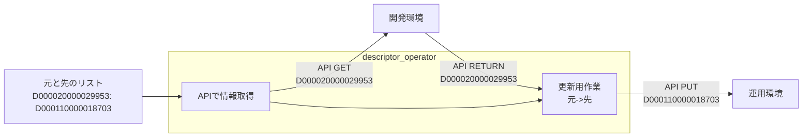
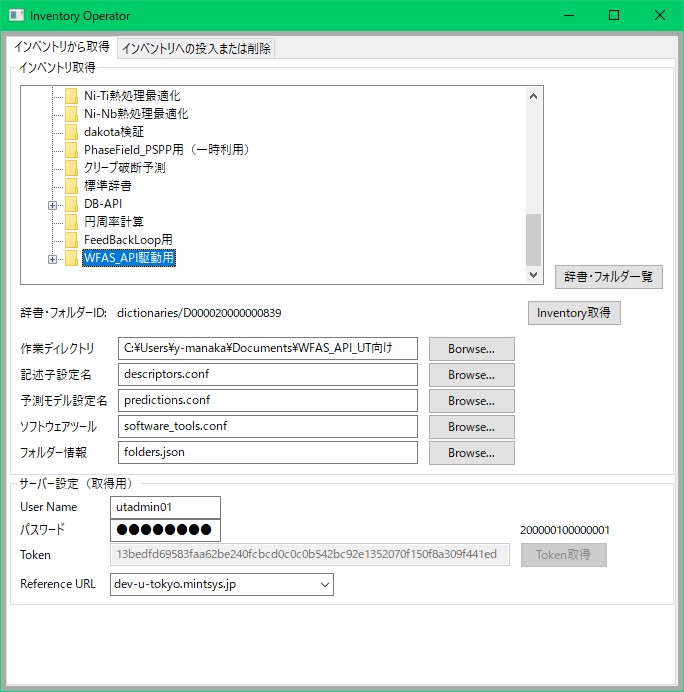
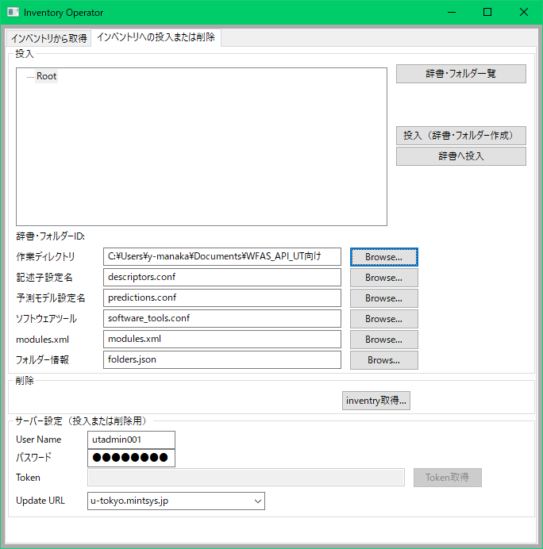

# リポジトリ概要
本リポジトリには、以下の複数のアプリケーションがある。それぞれの説明を後述する。

* inventory-operator
* prediction_module_operator
* descriptor_operator

# Inventory-Operatorマニュアル

## 概要
本マニュアルはInventoryAPIを利用して、サイト間の記述子、予測モデル、ソフトウェアツールを展開するためのソフトウェアのインストール、利用方法を記述します。

## システム要件
* python2.xおよびwxpython3.xが動作する、Linux/Windows/(MacOS)。
* python3.6以降およびwxpython4.0.6以降が動作する、Linux/Windows/(MacOS)
※ MacOSは未確認。（以前の経験上、動作は可能なはず）
* 追加のパッケージ
  + requests(security)
  + [authentication-operator(SSO対応)](https://gitlab.mintsys.jp/midev/authentication_operator)
  + [module_copy(Inventory操作本体)](https://gitlab.mintsys.jp/midev/module_copy)
  + MI-API(1.2.0以降)
  + [webapi(misrc_webapi)](https://gitlab.mintsys.jp/midev/misrc_webapi)
  + [インベントリID一元管理ソフト](https://gitlab.mintsys.jp/midev/misrc_inventory_management.git)

## 注意事項
inventory-operatorを使用するにあたっての概要と現在判明している問題である。

### 流れ
本バージョンからインベントリ複製の流れは以下のようになっています。
* 対象サイトのログインIDユーザーの辞書に登録されているインベントリデータ（JSON）と辞書・フォルダー情報を取得
* 対象サイトのログインIDユーザーに取得したインベントリデータと辞書・フォルダー情報を元に辞書とフォルダーを再構築（階層構造は同じにはなりません）し、登録したインベントリデータをこの辞書またはフォルダーに登録する。
* 登録後にmodules.xmlを指定していればこれを取得時のIDから登録時のIDへ内部のIDを変換し、アセット登録で使用可能な状態にする。
  + この時使うmodules.xmlはworkflow_python_lib/predictuin_modules_cut.pyを使って切り出す。

### 注意事項

* メタ項目とタグ

メタ項目とタグはメタIDとタグIDが一部にサイトIDを含んでおり、未対応である。現バージョンではメタIDおよびタグIDを含まないインベントリ情報のみが扱える。

万一メタ項目とタグ項目を含んだインベントリをコピーした場合IDが無いという応答が発生し、登録が途中で停止する。

* Windowsでの動作
基本的には問題ないはずだが、文字コードの問題がまだ一部に残っているので、しばらくは動作非対象とする。

# 管理編
## wxPython
wxPythonのインストール方法。
### Windows
以下のURLから python2.7系をインストールしている場合は、wxPython3.0-win64-3.0.2.0-py27.exeを取得、python2.6系をインストールしている場合は wxPython3.0-win64-3.0.2.0-py26.exeを取得し、インストールする。
https://sourceforge.net/projects/wxpython/files/wxPython/3.0.2.0/

### CentOS6とpython2.7
Windowsと同じURLから wxPython-src-3.0.2.0.tar.bz2 を取得する。
適当な場所に展開し、以下を実施する。
```
# tar xfj wxPython-src-3.0.2.0.tar.bz2
# cd wxPython-src-3.0.2.0/wxPython
# python setup.py install
```
pythonはシステムデフォルトまたは別インストールしたpython2.7などを使用する。

### CentOS7とpython2.7
CentOS7では環境が新しいためか、安全なインストール方法がまだほとんどありません。（検索してもあまりヒットしない）。WindowsやCentOS6用のパッケージもインストールに失敗します。このためEPELの早期？バージョンなどを取得して、yumでEPELの依存ライブラリをインストールした後、本体インストールというやや変則的なインストールを行います。また、実行中もワーニングがたくさん出るので、あまりおすすめじゃないかもしれません。GUIも表示が

以下のURLから、wxPython-3.0.2.0-11.el7.centos.x86_64.rpmを取得する。

https://copr-be.cloud.fedoraproject.org/results/erp/wxpython-3.0.2/epel-7-x86_64/00605775-wxPython/

yumで依存ライブラリをインストールしておく。
```
# yum install epel-release -y
# yum install --enablerepo=epel wxGTK wxGTK3 wxGTK-devel wxGTK3-devel wxBase wxBase3 wxGTK-media wxGTK-gl wxGTK3-media wxGTK3-gl
```
本体をrpmコマンドでインストールする。
```
# rpm -ivh wxPython-3.0.2.0-11.el7.centos.x86_64.rpm
```

pythonはシステムデフォルト(2.7.5)を使用する。

### CentOS7とpython3.6以降
wxpython3.xはpython3では対応していないため使用不可である。しかしCentOS7とpython2.7のものより比較的簡単に構築が可能になっている。手順は以下のとおり。
* gtk3およびgtk3-develのインストール(yum)
* pathlib2のインストール(pip)
* wxpythonのインストール(pip)

※ gtk3は既にインストール済みかもしれないので、rpm -q -aなどで確認し、インストール済みならgtk3-develのみインストールするなど適宜対応を変えること。  
※ pathlib2とwxpythonのインストールは一緒にはできないので、別々に実施すること。

### 動作確認
pythonを実行し、wxライブラリをimportしてみる。
```
$ python
>>> import wx
>>>
```
なにも表示されなければインストールは正常。
以下のようなら、何かしら失敗している。
```
$ python
>>> import wx
Traceback (most recent call last):
  File "<stdin>", line 1, in <module>
ImportError: No module named wx
>>> 
```
## インストールと実行
本体はgitで管理しています。以下のように適当な場所で、git cloneして実行してください。
```
$ git clone ssh://git@gitlab.mintsys.jp:50022/midev/inventory-operator.git
$ cd inventory-operator
$ python inventory-operator.py
```

## ユーザー情報
InventoryAPIはアクセスのために、必要な情報として、以下の３つがあります。
* URL
    * 操作対象のサイトへのURL（選択）
* ログインID
* ログインパスワード

Inventory-APIへのアクセスキーとして各ユーザー毎のトークンを使用するが、本スクリプトではログインIDとパスワードからMIntシステムが用意しているSSOの機能を利用して取得する。URLは操作対象のMIntシステムを指定するものである。この値は保存されるが、ログインIDとログインパスワードは保存されない。

## configファイル
プログラムの動作上、必要な設定値、保存値などはinventory-operator.iniにiniファイル形式で保存される。記述子、予測モデル、ソフトウェア・ツールを取得した内容は、このファイルで指定したディレクトリのそれぞれのファイルに保存される。

※ ファイルはiniファイルのフォーマットで記述されます。  
※ 存在しない場合、プログラムが自動的に作成します。  
※ プログラムの最初の起動後、一旦終了し、iniファイルの内容を見直し、必要なら設定し直しを行うこと。  

### ファイル内容
見直すべき項目など記述する。

* Systemセクション
    + インベントリ登録に使用するサブモジュールの場所を指定する。
* Referenceセクション
    + 参照タブでの保存値。
    + urlキー：サーバー名を保存している
    + conffile：ワーキングディレクトリの場所
    + descriptor_conf : 記述子用構成ファイルの名前
    + prediction_conf : 予測モデル用構成ファイルの名前
    + software_took_conf : ソフトウェアツール用構成ファイルの名前
* Updateセクション
    + 更新タブでの保存値。保存内容の詳細はReferenceセクションと以下を除き同一。
    + folder_info : 登録プログラムが使用するインベントリ辞書・フォルダの構成ファイル
    + modules_xml_info : インベントリ登録後に作成される新旧対応表を使用して作成するインポート用modules.xmlの元のファイル名。
* Serversセクション
    + 操作対象のサーバーURLを書き連ねる。
    + このURLがセクション名となり、サーバー毎の情報を設定する。
* サーバー名セクション
    + 各サーバー毎の設定値
    + version : APIのバージョン番号

### その他の設定ファイル
* Inventory.confファイル
    + ワーキングディレクトリ中に作成される。
    + 主にインベントリ取得時の動作設定が記述される。
    + authorizeセクション
        - user_id：GUIで選択したユーザー名のID。プログラムが自動的に記入します。
        - token：GUIで選択したユーザー名のトークン。プログラムが自動的に記入します。
    + resourceセクション
        - url：GUIで選択した取得または登録先のサイトURL。プログラムが自動的に記入します。
        - query：API用のクエリ文字列。今バージョンでは使用しません。
    + fileセクション
        - 基本的にそのままとします。プログラムが自動的に作成します。
        - object：取得、登録用エンドポイントパス名
        - inputfile：登録したい記述子、予測モデル、ソフトウェア・ツールの格納ファイル名。
        - outputfile：取得した記述子、予測モデル、ソフトウェア・ツールの格納ファイル名。
        - modules.xml：登録時、登録内容に沿って変更したいモジュールをmodules.xmlから抜粋した部分。 

* インベントリ用構成ファイル
  + inventory-operator.iniのReference/Updateセクションの```*_conf```ファイル
  + 取得では使用されない
  + 登録で登録用プログラムが使用する。
  + 内容は取得時作成される。

# prediction_model_operatorについて
このプログラムは予測モデルの取得、複製、入出力ポートの作成を簡易にコマンドラインから行うプログラムである。
## 概要
このプログラムは３つの動作モードを備える。
* 予測モデルの情報をJSON形式で取得、ファイルに保存
* 予測モデルの複製
* 予測モデルの入出力ポートの作成
* 予測モデルの別環境同士の情報をシンクロ（更新）

予測モデルの入出力ポートの作成には以下の条件がある。  
* 記述子IDが分かっている
* ポート名を指定した記述子IDの「主たる名前」を使う

## システム要件
inventory-operatorに準じる。

## ヘルプの表示
```
$ python3.6 prediction_model_operator.py 
モードを指定してください。
不明なモード指定です(None)

予測モデル複製プログラム
Usage:
$ python3.6 prediction_model_operator.py [options]
  Options:

     mode          : copy 記述子複製を実行する
                   : get 記述子取得のみを実行する
                   : add_desc 入出力ポートを連続で登録する。
                   : update 複製後のアップデートを行う 要記述子履歴ファイル
 mode : 共通
     misystem_from : 複製元の環境指定（e.g. dev-u-tokyo.mintsys.jp）
     token_from    : 複製元のAPIトークン（無い場合、ログインプロンプト）
     prediction_id : 複製したい予測モデルID（e.g. M000020000031477）
 mode : copy/update
     misystem_to   : 複製先の環境指定（指定がない場合は、同環境内で複製
     token_to      : 複製先のAPIトークン（同上）
  prediction_id_to : 更新先予測モデルID(e.g. M000020000031477) 
     history       : 複製元と複製先のIDテーブル出力ファイル名
       or
     history_db    : misrc_inventory_managementプロジェクトの絶対パス
```
* site url : dev-u-tokyo.mintsys.jp/nims.mintsys.jp/u-tokyo.mintsys.jp
* prediction model id : Mxxxxxyyyyyyyyyy
* mode : 以下のどれか
  + get : 指定したIDの予測モデルをMIntシステムから取得し、```prediction-<予測モデルID>.json```として保存する。
  + copy : 指定したIDの予測モデルをMIntシステムから取得し、新規予測モデルとして複製する。取得した予測モデル情報は```prediction-<予測モデルID>.json```として保存する。
  + put_desc : 指定した記述子IDの予測モデルの入出力ポートに連続して記述子を追加する。
  + update : ```*_from```の予測モデル(prediction_id)を```*_to```の予測モデル(prediction_id_to)として更新。各ポートの記述子IDの更新元と移植先の対応表のファイル（history(e.g. descriptors.idsなど）が必要。
* history_dbを指定するようにしてください。historyは機能削除予定です。

## 取得（mode:getの場合)
```
$ python3.6 ~/inventory-operator/prediction_model_operator.py dev-u-tokyo.mintsys.jp M000020000004486 get
予測モデルを取得する側のログイン情報入力
ログインID: utadmin01
パスワード: 
M000020000004486 の予測モデルの詳細情報を取得しました
$ ls -ltr prediction-M000020000004486.json
-rw-rw-r-- 1 misystem misystem 26405  8月 27 09:04 2020 prediction-M000020000004486.json
```

## 複製(mode:copy)

```
$ python3.6 prediction_model_operator.py misystem_from:dev-u-tokyo.mintsys.jp misystem_to:nims.mintsys.jp history_db:/home/misystem/assets/modules/misrc_inventory_management mode:copy prediction_id:M000020000004491
dev-u-tokyo.mintsys.jp から nims.mintsys.jp へ M000020000004491 の予測モデルを複製します。
予測モデルを取得する側のログイン情報入力
ログインID: utadmin01
パスワード: 
M000020000004491 の予測モデルの詳細情報を取得しました
予測モデルを更新する側のログイン情報入力
ログインID: manaka
パスワード: 
一元管理リスト
予測モデル(M000110000005496)を複製しました。
```

実行が成功すると最後の新しい予測モデルID「M000020000005496」が表示される。

## 更新

```
$ python3.6 prediction_model_operator.py misystem_from:dev-u-tokyo.mintsys.jp misystem_to:nims.mintsys.jp prediction_id:M000020000004474 history_db:/home/misystem/assets/modules/misrc_inventory_management mode:update prediction_id_to:M000110000005460
予測モデルを取得する側のログイン情報入力
ログインID: utadmin01
パスワード: 
M000020000004474 の予測モデルの詳細情報を取得しました
予測モデルを取得する側のログイン情報入力
ログインID: manaka
パスワード: 
M000110000005460 の予測モデルの詳細情報を取得しました
一元管理リスト
予測モデル(M000110000005460)を更新しました。
```

### 注意事項
```
{'errors': [{'code': '0050', 'message': '記述子 が存在しません。(ID : D000020000030805)'}]}
```
複製（別サイト宛）、更新作業の時、このような表示になったら、予測モデルの元IDに存在するポートの記述子に対して、複製または更新する先に対応する記述子が複製されていないことを示します。descriptor_operator.pyで該当IDの記述子を複製するか、一元管理DBに対応を追加してください。

## ポートの連続追加作業
1. ログイン - プログラム実行後、最初の一度だけ
2. 記述子IDの入力。IDを入力したら3.へ。空白なら指定した記述子で予測モデルを更新して終了。「end」なら更新せずに終了。
3. 指定したIDの主たる名前の表示
4. この記述子を入力ポーとか出力ポートのどちらに追加するか？
5. 2.に戻る。

### 注意事項
* 指定した記述子IDに関する確認
  + すでに入力済みか？
  ```
  追加する記述子IDの入力
  記述子ID: D000020000031484
  記述子名(D000020000031484):Hf_質量百分率
  to input(1) / to output(2): 2
  ポート名(Hf_質量百分率) はすでに出力ポートに登録があります。
  追加する記述子IDの入力
  記述子ID:
  ```
  + 存在しているかどうか？
  ```
  追加する記述子IDの入力
  記述子ID: D000020000031485
  記述子取得失敗
  {"errors":[{"code":"0050","message":"記述子 が存在しません。 (ID:http://mintsys.jp/inventory/descriptors/D000020000031485)"}]}
  追加する記述子IDの入力
  記述子ID:
  ```
* ポート名の編集は不可（将来対応予定）

### 実際の操作(入出力追加)
```
$ python3.6 prediction_model_operator.py dev-u-tokyo.mintsys.jp M000020000004387 put_desc
予測モデルを取得する側のログイン情報入力
ログインID: utadmin01
パスワード: 
M000020000004387 の予測モデルの詳細情報を取得しました
追加する記述子IDの入力
記述子ID: D000020000031459
記述子名(D000020000031459):Zr_質量百分率
to input(1) / to output(2): 1
追加する記述子IDの入力
記述子ID: D000020000031484
記述子名(D000020000031484):Hf_質量百分率
to input(1) / to output(2): 1
追加する記述子IDの入力
記述子ID: 
予測モデルを変更して終了します。
```


# descriptor_operatorについて
このプログラムは記述子の取得、複製を簡易にコマンドラインから行うプログラムである。
## 概要
このプログラムは３つの動作モードを備える。
* 記述子の情報をJSON形式で取得、ファイルに保存
* 記述子の複製
* 記述子の別環境同士の情報をシンクロ（更新）

また、履歴ファイル(inventory-operatorで作成される、descriptors.idsなど)を指定することで、記述子複製の履歴を追記していくことが可能である。

### 更新の流れ

更新作業は以下の用に、元と先のリスト（history）を元に行われる。


## システム要件
inventory-operatorに準じる。

## 操作の流れ
### 取得
```
$ python3.6 decriptor_operator.py misystem_from:dev-u-tokyo.mintsys.jp mode:get descriptor_id:D000020000031457
記述子を取得する側のログイン情報入力
ログインID: utadmin01
パスワード: 
ID(D000020000031457) の記述子の詳細情報を取得しました
$ ls -l descriptor-D000020000031457.json
-rw-rw-r-- 1 misystem misystem 620  9月 14 11:44 2020 descriptor-D000020000031457.json
```

### 複製
```
$ python3.6 decriptor_operator.py misystem_from:dev-u-tokyo.mintsys.jp misystem_to:nims.mintsys.jp mode:copy history:組成分解ツール/descriptors.ids descriptor_id:D000020000031462
記述子を取得する側のログイン情報入力
ログインID: utadmin01
パスワード: 
ID(D000020000031462) の記述子の詳細情報を取得しました
記述子を複製する側のログイン情報入力
ログインID: manaka
パスワード: 
{'descriptor_id': 'http://mintsys.jp/inventory/descriptors/D000110000018756'}
```

実行が成功すると最後の新しい記述子ID「D000110000018756」が作成されている。

### 更新
```
$ python3.6 descriptor_operator.py misystem_from:dev-u-tokyo.mintsys.jp misystem_to:nims.mintsys.jp token_from:from側のトークン token_to:to側のトークン history:組成分解ツール/descriptors.ids mode:update
ID(D000020000029953) の記述子の詳細情報を取得しました
記述子(D000110000018703) を更新しました。
ID(D000020000029954) の記述子の詳細情報を取得しました
記述子(D000110000018704) を更新しました。
...途中省略...
ID(D000020000031508) の記述子の詳細情報を取得しました
記述子(D000110000018776) を更新しました。
ID(D000020000031457) の記述子の詳細情報を取得しました
記述子(D000110000018777) を更新しました。
```

### 追加情報
* token_fromとtoken_to
  + token_fromとtoken_to(他環境への複製の場合）を指定すると、ログインプロンプトの入力は不要。
* history指定
  + 既存の履歴ファイル(invneotry-operator作成のdescriptors.idsなど）を指定すると、追記される。
  + 指定し無い場合、カレントディレクトリにdescritors.idsを作る。（存在すれば追記）
  + まだ履歴ファイルによる操作は更新元情報をAPIで取得する形式。存在するJSONファイルへの対応を実装中。

## ヘルプの表示
```
$ python3.6 decriptor_operator.py misystem_from:dev-u-tokyo.mintsys.jp
記述子IDを指定してください。

記述子複製プログラム
Usage:
$ python3.6 decriptor_operator.py [options]
  Options:

     mode          : copy 記述子複製を実行する
                   : get 記述子取得のみを実行する
                   : update history指定のファイルから複製後のアップデートを行う
     misystem_from : 複製元の環境指定（e.g. dev-u-tokyo.mintsys.jp）
     misystem_to   : 複製先の環境指定（指定がない場合は、同環境内で複製
     token_from    : 複製元のAPIトークン（無い場合、ログインプロンプト）
     token_to      : 複製先のAPIトークン（同上）
     descriptor_id : 複製したい記述子ID（e.g. D000020000031477）
     history       : 複製元と複製先のIDテーブル出力ファイル名）
```
* misystem from : dev-u-tokyo.mintsys.jp/nims.mintsys.jp/u-tokyo.mintsys.jp
* misystem to : dev-u-tokyo.mintsys.jp/nims.mintsys.jp/u-tokyo.mintsys.jp
* descriptor id : Mxxxxxyyyyyyyyyy
* mode : 以下のどれか
  + get : 指定したIDの記述子をMIntシステムから取得し、```descriptor-<記述子ID>.json```として保存する。
  + copy : 指定したIDの記述子をMIntシステムから取得し、新規記述子として複製する。取得した記述子情報は```prediction-<予測モデルID>.json```として保存する。
  + update : ```*_from```の記述子IDを```*_to```の記述子として更新(update)する。更新するIDは記述子IDの複製元と複製先の対応表のファイル（historyで指定(e.g. descriptors.idsなど）から取得する。updateが指定された場合、descriptor_idにより指定されたIDは無視される。

# 利用者編

## 使用方法(GUI編)
このツールは記述子、予測モデル、ソフトウェア・ツールを元になるサイトの辞書から取得して、
展開先のサイトの辞書へ登録するスタイルです。辞書から辞書へです。
そのため、細かな記述子、予測モデル、ソフトウェア・ツールの個別選択はできません。

### サイト間展開
* まずは記述子の取得  


1. 「インベントリから取得」タブをクリック
1. 作業ディレクトリを指定する
1. サーバー設定（取得用）を設定する
1. 辞書・フォルダー一覧をクリック
1. 希望の辞書をクリック
1. Inventory取得ボタンをクリック

* 取得できたら、登録  


1. インベントリへの投入または削除タブをクリック
1. 作業ディレクトリを指定する（取得時のディレクトリなど）
1. modules.xmlを指定する
1. サーバー設定（投入または削除用）を指定する。
1. 投入（辞書・フォルダー作成）をクリック

※上記以外の設定項目はそのままでよい

* 登録情報が旧バージョンの辞書to辞書用のデータの場合
1. 作業ディレクトリを指定する（取得時のディレクトリなど）
1. サーバー設定（投入または削除用）を指定する。
1. 辞書・フォルダ一覧をクリック
1. 希望の辞書をクリック
1. 辞書へ投入をクリック
 
※１、辞書to辞書のコピーを行う場合は展開先の辞書は予め作成しておいてください。
※２、作業ディレクトリはiniファイルに保存されます。
※３、取得した記述子は実行したシェルにログとして表示されます。

### 削除
同じように辞書単位での削除です。


1. イベントリへの投入または削除タブをクリック
1. ユーザー情報（投入または削除用）を選択
1. 辞書・フォルダ一覧をクリック
1. 希望の辞書をクリック
1. 削除ボタンをクリック
1. 一覧に表示された記述子、予測モデル、ソフトウェア・ツールのうち、削除したいものの左にあるチェックボックスにチェックを入れてOKボタンをクリックします

※１、一番上のカラムの「check」「uncheck」をクリックすると、全項目のチェックをon/offできます。
※２、赤い記述子、予測モデル、ソフトウェア・ツールはそれ自体は削除済みですが、辞書のエントリから削除されていないものと推測されます。今の所これを削除する方法は不明です。仕様を変更して赤くなる記述子、予測モデル、ソフトウェア・ツールは表示しないようにするかもしれません。

## 使用方法（非GUI編）
このツールは記述子、予測モデル、ソフトウェアツールをinventory APIにより取り出したJSONファイルがそれぞれ存在していれば、限定的であるがGUIを使用しなくても記述子、予測モデル、ソフトウェアツールを追加することが可能である。その場合の方法を記述する。
### 設定
Inventory.confファイルに下記の用に設定を実施する。
* ログイン情報（トークンなど）  
  authorizeセクションのuser_idに自身のUSER IDを、tokenに自身のAPI アクセストークンを指定する。
* 追加先の辞書の情報  
  resourceセクションのurlに追加先の辞書IDを指定する。
* 記述子、予測モデル、ソフトウェアツールの各ファイル名  
  fileセクションのinputfileに3行にわけて、記述子、予測モデル、ソフトウェアツールの各ファイル名を指定する。
* 予測モジュール定義ファイルのファイル名  
  fileセクションのmodules.xmlに予測モジュール定義ファイルを指定する。

※ 辞書情報は、inventory画面において、inventoryを追加したい辞書を開いた状態で、ブラウザのURL欄の  
```
https://dev-u-tokyo.mintsys.jp/inventory/users/200000100000001/dictionaries/20000000818/folders/20000026418?sortOrder=asc&sortColumn=1&startPage=0&length=100&search=&type=&dispAccept=
```
のうち、  
```
users/200000100000001/dictionaries/20000000818/folders/20000026418
```
を辞書IDは接頭辞"D"と共に企業ID5桁（0前詰め）＋辞書ID10桁の15桁に、フォルダーIDも接頭辞"F"をと共に企業ID5桁（0前詰め）＋フォルダID10桁の15桁にして指定します。
```
users/200000100000001/dictionaries/D000020000000818/folders/F000020000026418
```


出来上がりの例(開発環境宛の設定例)
```
[authorize]
user_id = 200000100000001
token = 13bedfd69583faa62be240fcbcd0c0c0b542bc92e1352070f150f8a309f441ed

[resource]
url = users/200000100000001/dictionaries/D000020000000818/folders/F000020000026418
query = 

[file]
object = descriptor
           prediction-model
           software-tool
inputfile = dst_descriptors.json
               dst_prediction-models.json
               dst_software-tools.json
outputfile = src_descriptor.json
              src_prediction.json
              src_software_tool.json
modules.xml = modules.xml
```

### 実行
pythonプログラムを実行する。
* 使用方法
```
usage : python postInventory4.py <API URL>
```
* 実際の使用例
```
$ python3.6 postInventory4.py https://nims.mintsys.jp:50443/inventory-api/v5
```
